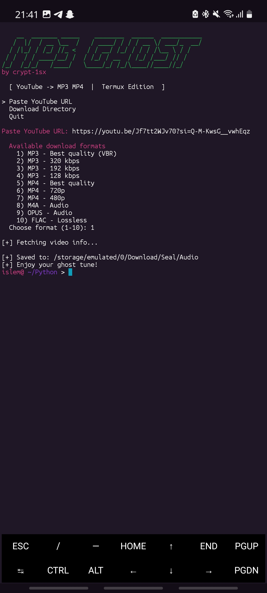

# Mp3 GHOST

> YouTube to MP3 downloader for **Termux (Android)** and Linux.

```
    __  _______ _____    ________  ______  ___________
   /  |/  / __ \__  /   / ____/ / / / __ \/ ___/_  __/
  / /|_/ / /_/ //_ <   / / __/ /_/ / / / /\__ \ / /   
 / /  / / ____/__/ /  / /_/ / __  / /_/ /___/ // /    
/_/  /_/_/   /____/   \____/_/ /_/\____//____//_/     
```
*by crypt-1sx*



---

## Features

- Clean interactive menu (↑/↓ to navigate, Enter to select)
- Paste a YouTube URL and download it as **MP3, MP4, M4A, OPUS or FLAC**
- **Choose your format** (MP3 quality levels, MP4 resolutions, lossless audio) before downloading
- **Approximate file size shown next to every format** before you download
- **Live download progress bar**
- Embedded thumbnail & metadata
- **Changeable download directory** from the menu
- No manual dependency setup — **one command** installs and runs everything

## Requirements

Nothing to install manually. The installer handles Python, `yt-dlp` and `ffmpeg` for you.

## Install & Run

You only need to run **one thing**.

### On Termux (Android)

```bash
pkg install -y git
git clone https://github.com/crypt-1sx/mp3-ghost.git
cd mp3-ghost
bash setup.sh
```

**To open it again later (no need to run setup.sh again):**

```bash
cd mp3-ghost
python3 mp3_ghost.py
```

### On Linux

```bash
git clone https://github.com/crypt-1sx/mp3-ghost.git
cd mp3-ghost
bash setup.sh
```

**To open it again later (no need to run setup.sh again):**

```bash
cd mp3-ghost
python3 mp3_ghost.py
```

The installer auto-detects your system, installs everything, and launches the script.

## Manual install (step by step)

Prefer to do it yourself? Install the requirements, then run the script.

### On Termux (Android)

```bash
pkg update
pkg install -y python ffmpeg git
pip install yt-dlp
git clone https://github.com/crypt-1sx/mp3-ghost.git
cd mp3-ghost
python mp3_ghost.py
```

### On Linux

```bash
sudo apt update
sudo apt install -y python3 python3-pip ffmpeg
pip install yt-dlp
git clone https://github.com/crypt-1sx/mp3-ghost.git
cd mp3-ghost
python3 mp3_ghost.py
```

## Usage

1. Pick **Paste YouTube URL** and press Enter
2. Type/paste the video URL and press Enter
3. Choose a download format from the list and press Enter
4. Watch the progress bar — the file is saved to the download directory

> In the format list you can pick **Return to URL input** to go back and paste a different link. Type `menu` instead of a URL to go back to the main menu.

> Default download directory: `/storage/emulated/0/Download/Seal/Audio`
>
> Change it anytime from the menu → **Download Directory**.

### Options

| Option              | What it does                                           |
| ------------------- | ------------------------------------------------------ |
| Paste YouTube URL   | Download a video as MP3 / MP4 / M4A / OPUS / FLAC      |
| Download Directory  | Show / change where songs are saved                    |
| Quit                | Exit the script                                        |

## Direct URL (fast)

You can also pass a URL straight from the command line:

```bash
python3 mp3_ghost.py "https://www.youtube.com/watch?v=..."
```

## Notes

- Termux storage access: run `termux-setup-storage` once if the script can't write to your chosen folder.
- MP3 conversion requires `ffmpeg` — installed automatically.
